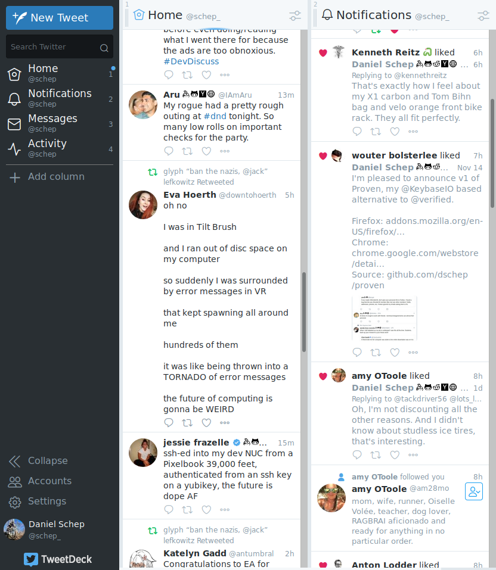

#  Proven
A [Keybase](https://keybase.io) based alternative to Twitter's verified
accounts.

Proven is a browser extension that adds badges like for keybase, github, etc
next to users names like Twitter's verified badge but based what accounts the
user has posted proofs for Keybase. See the screenshot for what it looks like.

