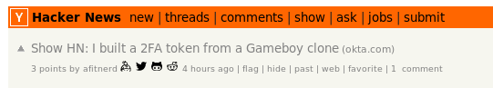

#  Proven

An alternative to Twitter's verified program powered by [Keybase](https://keybase.io).

**Warning about Twitters's new UI -- this new UI munges the names of CSS classes in the DOM and is currently unsupported. 
Similarly, Mobile no longer works for the same reason.**

Proven is a browser extension that adds badges like for keybase, github, etc
next to users names like Twitter's verified badge but based what accounts the
user has posted proofs for Keybase. See the screenshot for what it looks like.

In addition to twitter, it adds badges on Hacker News too.

To chat about Proven, pop into the [open Keybase Team](https://keybase.io/team/proven_extension)
for the project.

